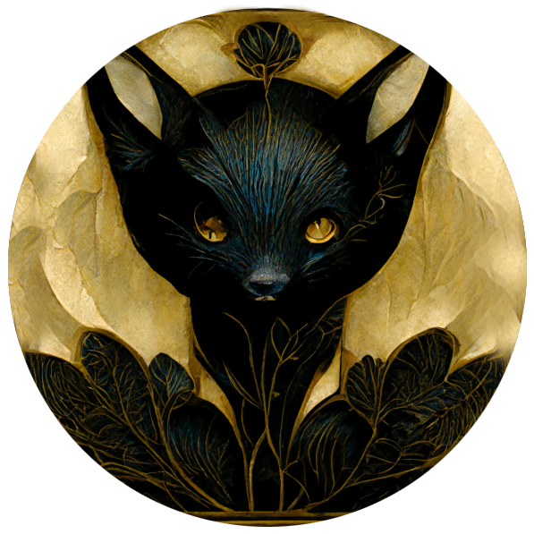

<a name="readme-top"></a>

<!-- Top Links Bar -->

[![LinkedIn][linkedin-shield]][linkedin-url]
[![Twitter][twitter-shield]][twitter-url]
[![Instagram][instagram-shield]][instagram-url]

<!-- PROJECT LOGO -->
<br />
<div align="center">
  
  <h1 align="center">Custom Mac Screen Saver</h1>
  </div>

<!-- PROJECT desc -->
  <p align="left">
Here you will find instructions on how to save your own video as a screensaver on your Mac under Sonoma and a Python script that converts an mp4 into a mov file and loops the video at a time of your choice.


# preperation

  1. go to /Library/Application\ Support/com.apple.idleassetsd/Customer/4KSDR240FPS
  2. parallel open screen saver in systemsettings and download whatever video
  3. find an mp4 you want as your screensaver

Your own video must be EXACTLY the length of the downloaded video. The script here converts an mp4 into a mov video and lets it run in the loop for a very specific time.
Follow the instructions below.


  
## Video Loop and Convert Script

This script takes an input MP4 video, loops it to a specified duration, and converts the final output to MOV format. The duration can be specified in the format of "hours:minutes:seconds" or "minutes:seconds".

### Requirements

- Python 3.x
- `ffmpeg` and `ffprobe`

### Installation

#### Install ffmpeg

##### Windows

1. Download the FFmpeg executable from the [FFmpeg website](https://ffmpeg.org/download.html).
2. Extract the ZIP file and move the `bin` folder to a location of your choice (e.g., `C:\ffmpeg`).
3. Add the path to the `bin` folder to your system's PATH environment variable.

##### macOS

Using Homebrew:

```sh
brew install ffmpeg
